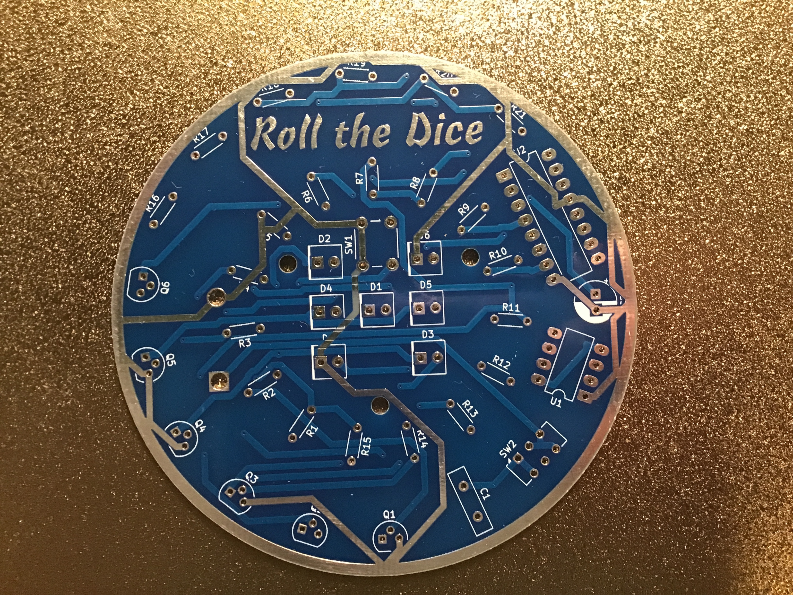
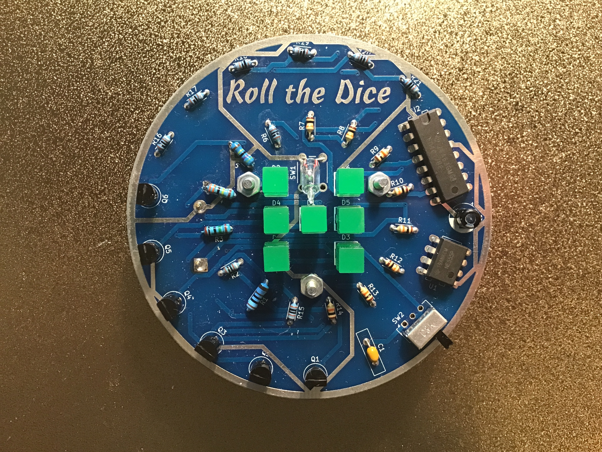

# Elektronische Dobbelsteen

Een elektronische dobbelsteen met 7 LED's in dobbelsteenpatroon, aangestuurd door een LM555 en CD4017. Schud de dobbelsteen, stop en de uitkomst verschijnt.

| | |
|---|---|
|  |  |
| *Lege PCB — ronde "Roll the Dice" vormfactor* | *Bestukt prototype* |

## In werking


## Beschrijving

De LM555 oscilleert met hoge frequentie zolang de balschakelaar (normally closed) contact maakt. Bij schudden verliest de bal even contact, waarna de oscillatie stopt en de teller blijft staan op een willekeurige uitgang. Vier transistoren (BC328 PNP en BC338 NPN) schakelen de zeven LED's aan in het juiste dobbelsteenpatroon voor de waarden 1 t/m 6.

De schuifschakelaar is de aan/uit schakelaar.

## Schema


[Interactieve stuklijst (iBOM)](https://htmlpreview.github.io/?https://github.com/renedeboer/elektronica_bouwpakketten/blob/main/555-en-4017/dobbelsteen/bom/ibom.html)

## Stuklijst

| Aanduiding | Waarde | Aantal |
|------------|--------|--------|
| U1 | LM555N (DIP-8) | 1 |
| U2 | CD4017 decade counter (DIP-16) | 1 |
| Q2, Q6 | BC328 PNP transistor | 2 |
| Q3, Q4 | BC338 NPN transistor | 2 |
| C1 | 100nF | 1 |
| C2 | 10µF / 10V elektrolytisch | 1 |
| R1, R2, R6 | 1kΩ | 3 |
| R3 | 10MΩ | 1 |
| R4, R5 | 4,7MΩ | 2 |
| R7–R14 | 10kΩ | 8 |
| R15–R21 | 270Ω | 7 |
| D1–D7 | LED (kleur naar keuze) | 7 |
| SW1 | Balschakelaar (normally closed) | 1 |
| SW2 | Schuifschakelaar DPDT | 1 |
| BT1 | 9V batterijclip | 1 |

## Dobbelsteenpatroon

De 7 LED's zijn geplaatst in het klassieke patroon van een dobbelsteen:

```
[D2]      [D6]

[D4] [D1] [D5]

[D7]      [D3]
```

De transistorenlogica zorgt dat bij elke uitgang van de 4017 (1 t/m 6) de juiste combinatie van LED's oplicht.

## Bouwinstructies

Zie de [seriepagina](../README.md) voor de algemene volgorde van montage.

### Specifieke aandachtspunten

- Let bij de transistoren goed op het type: de BC328 is een **PNP** type, de BC338 is een **NPN** type. Ze zijn allebei aanwezig in dit circuit en hebben een verschillende werking — verwisselen geeft een niet-werkende schakeling.
- **SW1** is een **balschakelaar** (normally closed) — de bal maakt normaal contact; bij schudden verliest hij dit even. Zorg dat de balschakelaar vrij kan bewegen in de behuizing.
- **C2 (10µF)** is elektrolytisch — let op polariteit.

## KiCad bestanden

Projectbestanden: `~/Documents/KiCad/projects/dice/dice/`

---

## Milieu-informatie

**Belangrijke milieu-informatie betreffende dit product**

Dit symbool op het toestel of de verpakking geeft aan dat dit product aan het einde van zijn levensduur niet bij het gewone huishoudelijk afval mag worden weggegooid. Gooi dit product (inclusief eventuele batterijen) niet bij het huisvuil — breng het naar een erkend inzamelpunt of retourpunt voor recycling. Neem voor meer informatie contact op met uw gemeente of lokale milieuinstantie.

Producten mogen voor recycling altijd worden teruggebracht of opgestuurd via de webshop op [rene-de-boer.nl](https://rene-de-boer.nl).
