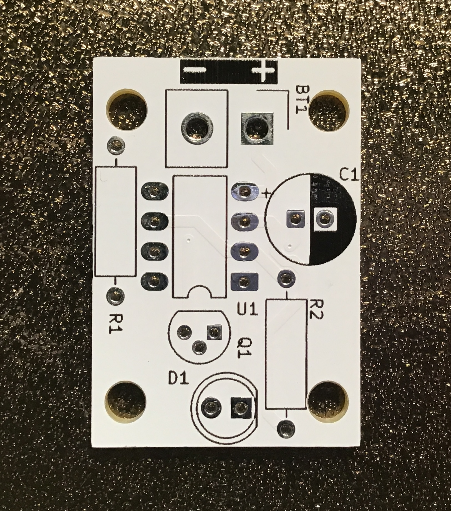

# LED Fading

Een LED die langzaam en vloeiend aan en uit ademhaalt, alsof hij leeft.

| | |
|---|---|
|  |  |
| *Lege PCB* | *Bestukt prototype* |

## In werking

## Beschrijving

De NE555 genereert een laagfrequent blokgolfsignaal. Een NPN transistor en een elektrolytische condensator zorgen samen voor de langzame op- en afbouw van de spanning door de LED — het zogenaamde "ademhaling" effect.

**Geen 4017 in dit circuit** — puur 555 met een transistor als stuurcomponent.

## Schema

[Handleiding / inlay (PDF)](schema/fadeled.pdf)

[Interactieve stuklijst (iBOM)](https://htmlpreview.github.io/?https://github.com/renedeboer/elektronica_bouwpakketten/blob/main/555-en-4017/fading/bom/ibom.html)

## Stuklijst

| Aanduiding | Waarde | Aantal |
|------------|--------|--------|
| U1 | NE555P (inclusief IC voetje DIP-8) | 1 |
| Q1 | NPN transistor | 1 |
| C1 | 100µF / 10V elektrolytisch | 1 |
| R1 | 15kΩ | 1 |
| R2 | 470Ω | 1 |
| D1 | LED (kleur naar keuze) | 1 |
| BT1 | 9V batterijclip | 1 |

## Bouwinstructies

Zie de [seriepagina](../README.md) voor de algemene volgorde van montage.

### Specifieke aandachtspunten

- **C1 (100µF)** is een elektrolytische condensator — let op de polariteit. De lange poot is de plus (+), de kant met de witte streep op de behuizing is de min (−).
- **Q1 (BC547)** heeft een vlakke en een ronde kant. De vlakke kant wijst zoals aangegeven op de silkscreen.
- De snelheid van het effect pas je aan door de waarde van R1 of C1 te wijzigen: groter = langzamer.

## KiCad bestanden

Projectbestanden: `~/Documents/KiCad/projects/555/555/555fading/`

---

## Milieu-informatie

**Belangrijke milieu-informatie betreffende dit product**

Dit symbool op het toestel of de verpakking geeft aan dat dit product aan het einde van zijn levensduur niet bij het gewone huishoudelijk afval mag worden weggegooid. Gooi dit product (inclusief eventuele batterijen) niet bij het huisvuil — breng het naar een erkend inzamelpunt of retourpunt voor recycling. Neem voor meer informatie contact op met uw gemeente of lokale milieuinstantie.

Producten mogen voor recycling altijd worden teruggebracht of opgestuurd via de webshop op [rene-de-boer.nl](https://rene-de-boer.nl).
