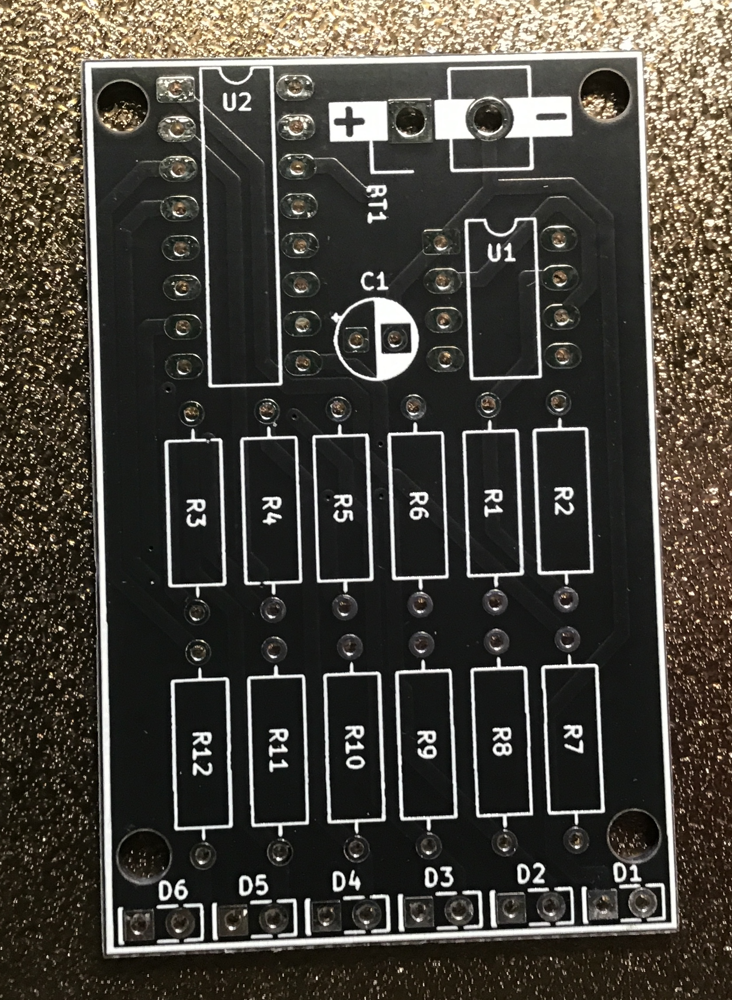
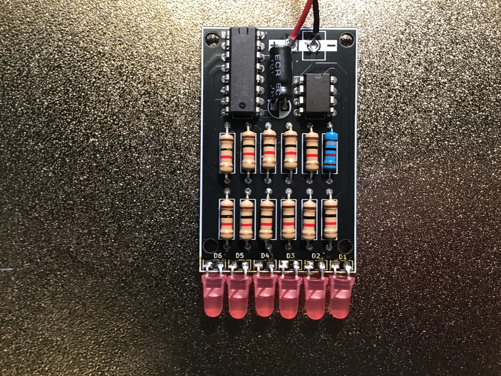

# Knight Rider

Vijf LED's die heen en weer lopen, geïnspireerd door de iconische verlichting van KITT uit Knight Rider.

| | |
|---|---|
|  |  |
| *Lege PCB* | *Bestukt prototype* |

## In werking

## Beschrijving

De NE555 genereert pulsen die de CD4017 decade counter aansturen. De 4017 telt van Q0 tot Q4 en terug, waardoor de vijf LED's om beurten oplichten en het "lopende licht" effect ontstaat.

De terugloop wordt gerealiseerd door de uitgang Q5 terug te koppelen naar de reset-pin van de 4017.

## Schema

[Interactieve stuklijst (iBOM)](https://htmlpreview.github.io/?https://github.com/renedeboer/elektronica_bouwpakketten/blob/main/555-en-4017/knightrider/bom/ibom.html)

## Stuklijst

| Aanduiding | Waarde | Aantal |
|------------|--------|--------|
| U1 | NE555P (DIP-8) | 1 |
| U2 | CD4017 decade counter (DIP-16) | 1 |
| C1 | 3,3µF / 10V elektrolytisch | 1 |
| R1 | 68kΩ | 1 |
| R2–R6 | 1kΩ | 5 |
| D1–D5 | LED (kleur naar keuze) | 5 |
| BT1 | 9V batterijclip | 1 |

> De weerstanden R7–R12 op de PCB zijn voor de terugkoppeling en stroombeperking; zie het schema voor de exacte waarden.

## Bouwinstructies

Zie de [seriepagina](../README.md) voor de algemene volgorde van montage.

### Specifieke aandachtspunten

- **U2 (CD4017)** is een 16-pins IC — zorg dat pin 1 (markering op het IC) overeenkomt met de markering op de socket.
- Alle 5 LED's op gelijke hoogte solderen geeft het mooiste effect.
- De snelheid pas je aan via R1 of C1: groter = langzamer.

## KiCad bestanden

Projectbestanden: `~/Documents/KiCad/projects/555/555/555knightrider/`

---

## Milieu-informatie

**Belangrijke milieu-informatie betreffende dit product**

Dit symbool op het toestel of de verpakking geeft aan dat, als het na zijn levenscyclus wordt weggeworpen, dit toestel schade kan toebrengen aan het milieu. Gooi dit toestel (en eventuele batterijen) niet bij het gewone huishoudelijke afval; het moet bij een gespecialiseerd bedrijf terechtkomen voor recyclage. U dient dit toestel naar uw verdeler of naar een lokaal recyclagepunt te brengen. Respecteer de plaatselijke milieuwetgeving. Heeft u vragen, contacteer dan de plaatselijke autoriteiten inzake afvalverwijdering.

Producten mogen altijd worden teruggebracht of opgestuurd via de webshop op [rene-de-boer.nl](https://rene-de-boer.nl).
