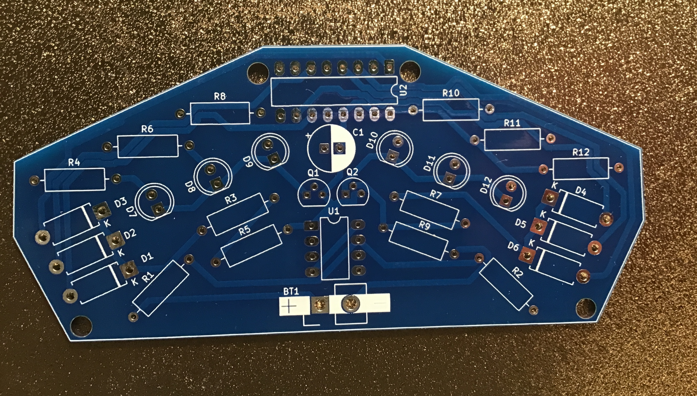
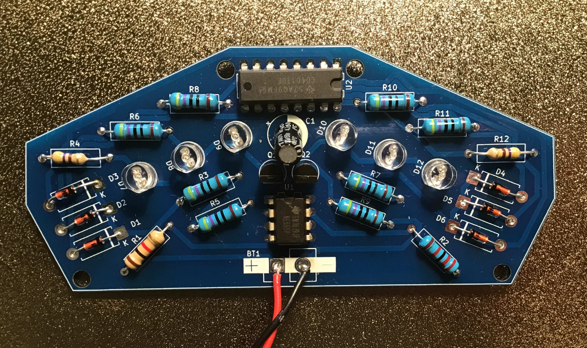

# Politielicht

Een afwisselend rood/blauw zwaailicht effect met 6 LED's, twee transistoren en een 4017 counter.

| | |
|---|---|
|  |  |
| *Lege PCB* | *Bestukt prototype* |

## In werking

## Beschrijving

De NE555 genereert pulsen voor de CD4017 decade counter. De 4017 verdeelt de LED's over twee groepen (rood en blauw) via twee BC547 transistoren. Het resultaat is een overtuigend politie-zwaailicht effect.

## Schema

[Interactieve stuklijst (iBOM)](https://htmlpreview.github.io/?https://github.com/renedeboer/elektronica_bouwpakketten/blob/main/555-en-4017/politielicht/bom/ibom.html)

## Stuklijst

| Aanduiding | Waarde | Aantal |
|------------|--------|--------|
| U1 | NE555P (DIP-8) | 1 |
| U2 | CD4017 decade counter (DIP-16) | 1 |
| Q1, Q2 | BC547 NPN transistor | 2 |
| C1 | 100µF / 10V elektrolytisch | 1 |
| R1 | 1kΩ | 1 |
| R2 | 22kΩ | 1 |
| R3–R12 | 470Ω | 10 |
| D1–D6 | 1N4148 signaaldiode | 6 |
| D7–D12 | LED (kleur naar keuze) | 6 |
| BT1 | 9V batterijclip | 1 |

## Bouwinstructies

Zie de [seriepagina](../README.md) voor de algemene volgorde van montage.

### Specifieke aandachtspunten

- **Gebruik rode LED's voor D7–D9 en blauwe LED's voor D10–D12** (of omgekeerd) voor het politielicht effect. Elke kleurcombinatie is mogelijk.
- **D1–D6 (1N4148)** zijn signaaldiodes in de stuuraansturing — let op de richting (streep op de diode = kathode, overeenkomend met de K-markering op de PCB).
- De transistoren Q1 en Q2 sturen elk een groep van 3 LED's aan.

## KiCad bestanden

Projectbestanden: `~/Documents/KiCad/projects/555/555/555police/`

---

## Milieu-informatie

**Belangrijke milieu-informatie betreffende dit product**

Dit symbool op het toestel of de verpakking geeft aan dat dit product aan het einde van zijn levensduur niet bij het gewone huishoudelijk afval mag worden weggegooid. Gooi dit product (inclusief eventuele batterijen) niet bij het huisvuil — breng het naar een erkend inzamelpunt of retourpunt voor recycling. Neem voor meer informatie contact op met uw gemeente of lokale milieuinstantie.

Producten mogen voor recycling altijd worden teruggebracht of opgestuurd via de webshop op [rene-de-boer.nl](https://rene-de-boer.nl).
