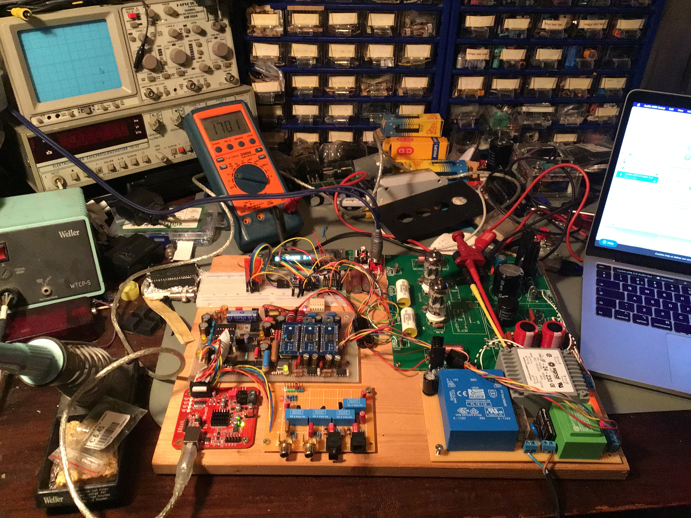
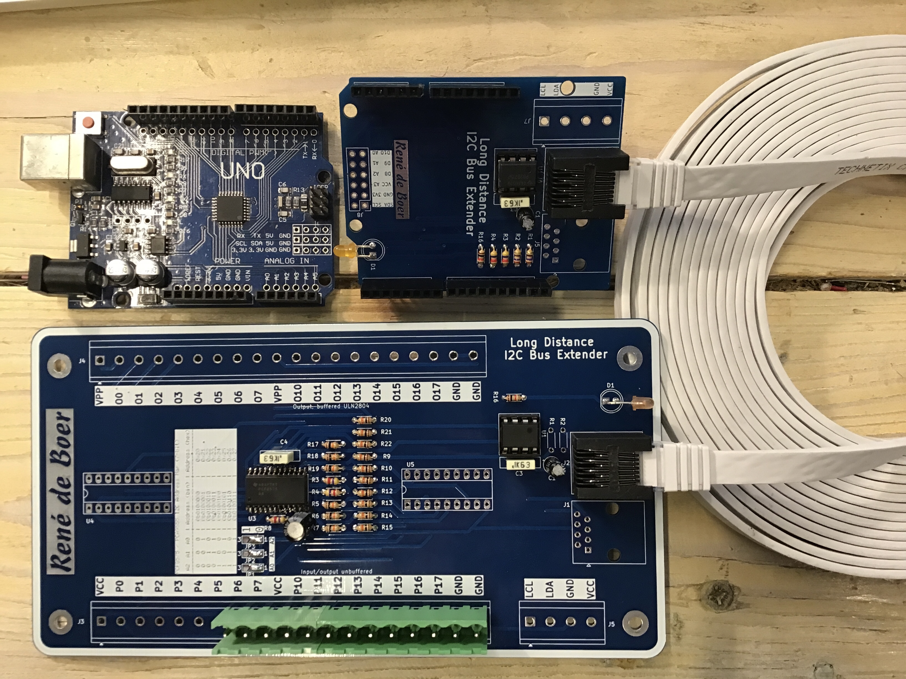
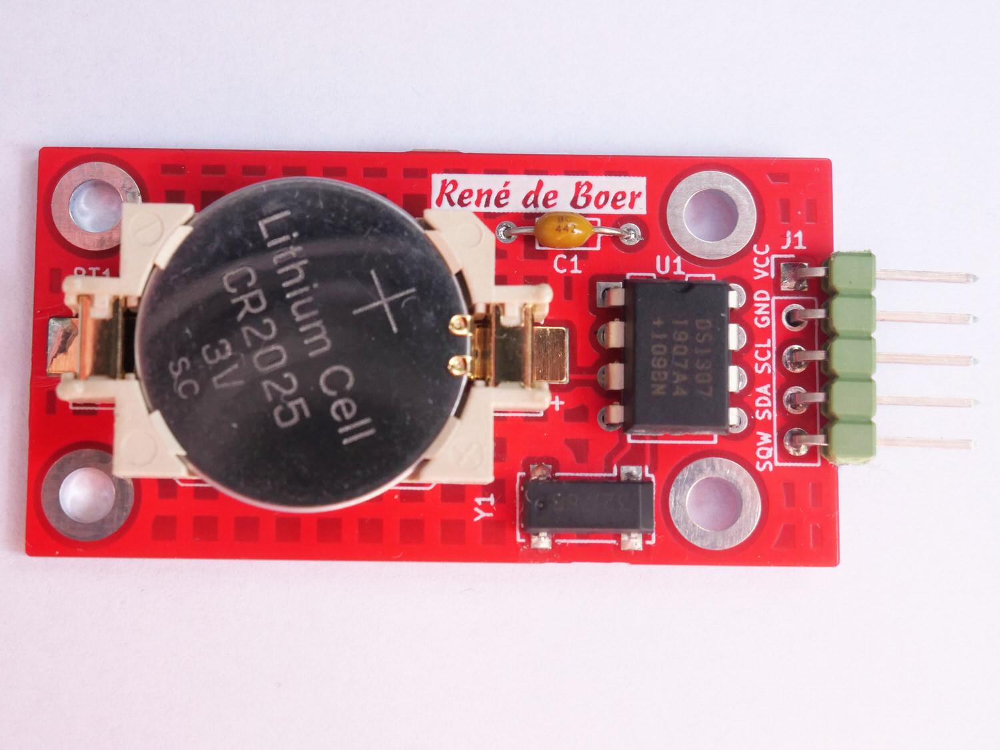

# Elektronica Bouwpakketten

Een verzameling zelfbouw elektronica bouwpakketten, van eenvoudige 555-timer schakelingen tot een VFD klok met Arduino. Alle bouwpakketten zijn ontworpen in KiCad.

Deze projecten zijn gemaakt om solderen en elektronica toegankelijk en leuk te maken — voor beginners die hun eerste LED-schakeling bouwen, en voor liefhebbers die iets eigens willen maken.

## Bestellen

De printplaten en complete bouwpakketten zijn te bestellen via de webshop op **[rene-de-boer.nl](https://rene-de-boer.nl)**.

## Overzicht

### Angry Cats From Space — ATtiny85 LED bouwpakketten

Vijf verschillende PCB's met een kat in de ruimte als thema. Allen aangestuurd door een ATtiny85 microcontroller via charlieplexing, gevoed door twee AA of AAA batterijen.

| Kit | Thema | LEDs | |
|-----|-------|------|-|
| [ACFS1 — Kat in UFO](angry-cats-from-space/acfs1-ufo/) | Kat in een vliegende schotel | 14 |  |
| [ACFS2 — Kat in een Raket](angry-cats-from-space/acfs2-raket/) | Kat in een raket | 20 |  |
| [ACFS3 — Kat in Ruimtepak](angry-cats-from-space/acfs3-ruimtepak/) | Kat in ruimtepak | 8 |  |
| [ACFS4 — Kat op de Maan](angry-cats-from-space/acfs4-maan/) | Kat op de maan | 12 |  |
| [ACFS5 — Kat op Saturnus](angry-cats-from-space/acfs5-saturnus/) | Kat op de planeet Saturnus | 12 |  |

Meer info over de hele serie: [Angry Cats From Space](angry-cats-from-space/)

---

### 555-timer en 4017 — Analoge LED bouwpakketten

Vier bouwpakketten op basis van de klassieke NE555/LM555 timer IC en de CD4017 decade counter. Puur analoge/digitale elektronica, geen microcontroller of software.

| Kit | Effect | |
|-----|--------|-|
| [LED Fading](555-en-4017/fading/) | LED die langzaam aan en uit ademhaalt |  |
| [Knight Rider](555-en-4017/knightrider/) | 5 LEDs die heen en weer lopen |  |
| [Politielicht](555-en-4017/politielicht/) | Rood/blauw zwaailicht effect |  |
| [Elektronische Dobbelsteen](555-en-4017/dobbelsteen/) | Dobbelsteen met balschakelaar |  |

Meer info over de hele serie: [555-timer en 4017](555-en-4017/)

---

### Overige bouwpakketten

| Kit | Beschrijving | |
|-----|-------------|-|
| [Phono Voorversterker](passieve-phono/) | Stereo phono voorversterker met passief RIAA netwerk tussen twee OPA606 trappen (Walter G. Jung topologie) |  |
| [Arduino I2C Shield](arduino-i2c-shield/) | Arduino Uno shield met P82B715P I2C bus extender |  |
| [VFD Klok](vfd-klok/) | Vacuüm fluorescentie display klok met Arduino Nano en RTC |  |
| [ZX Spectrum I2C](zx-spectrum-i2c/) | I2C uitbreidingskaart voor de ZX Spectrum 48K met BASIC software bibliotheek |  |

---

### Modules en bibliotheken

Eigen producten met een eigen GitHub repository. De broncode en updates staan daar; onderstaande pagina's geven een overzicht.

| Module | Beschrijving | |
|--------|-------------|-|
| [Vleermuis](vleermuis/) | ATtiny85 LED-bouwpakket, basis voor de Angry Cats From Space serie — [github.com/renedeboer/ReneDeBoer_Vleermuis](https://github.com/renedeboer/ReneDeBoer_Vleermuis) |  |
| [RTC Module](rtc/) | DS1307 real-time clock module met Arduino library, werkt met elke I2C master — [github.com/renedeboer/ReneDeBoer_RTC](https://github.com/renedeboer/ReneDeBoer_RTC) |  |

---

## Algemene informatie

- [Soldeertips en techniek](docs/solderen.md)
- [Benodigde gereedschappen en materialen](docs/benodigdheden.md)

## Licentie

**PCB layouts en artwork** © René de Boer — Alle rechten voorbehouden. Persoonlijk gebruik (zelf bouwen) is toegestaan; commercieel gebruik niet zonder toestemming.

**Schakelingen** — gebaseerd op publiek domein bronnen en fabrikantsdatasheets. De passieve phono schakeling is afkomstig uit de OPA606 datasheet, toegeschreven aan Walter G. Jung.

**Software** — gepubliceerd onder de [MIT Licentie](LICENSE).

Zie [LICENSE](LICENSE) voor de volledige tekst.
