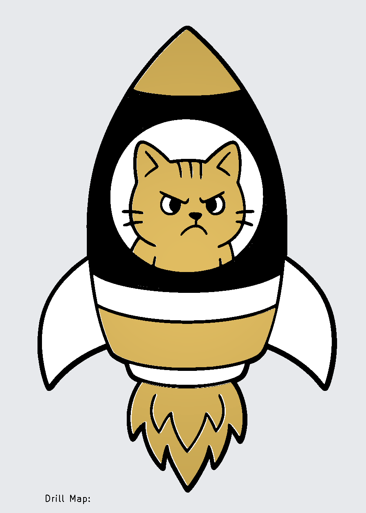

# ACFS2 — Kat in een Raket

Een kat die in een raket zit, met 20 animerende LEDs aangestuurd door een ATtiny85.

| | |
|---|---|
|  |  |
| *Artwork* | *Lege PCB* |

## Beschrijving

De PCB heeft de vorm van een raket, waarin een kat zit. Met 20 through-hole LED's is dit de kit met de meeste LED's in de serie. De ATtiny85 stuurt alle LEDs via charlieplexing met een mood-gebaseerde animatie.

## Stuklijst

| Aanduiding | Waarde / Type | Aantal |
|------------|--------------|--------|
| U1 | ATtiny85-20P | 1 |
| BT1, BT2 | AA of AAA batterijhouder | 2 |
| C1 | 100nF | 1 |
| D1–D20 | LED 3mm | 20 |
| R1–R5 | 100Ω–680Ω* | 5 |
| SW1 | DIP-schakelaar 1-polig | 1 |

## Bouwinstructies

Zie de [seriepagina](../README.md) voor de algemene volgorde van montage en de [soldeertips](../../docs/solderen.md).

### Specifieke aandachtspunten

- Met 20 LED's is dit de meest bewerkelijke kit uit de serie. Neem de tijd en controleer na iedere paar LED's de polariteit.

## Schema

KiCad projectbestanden: `~/Documents/KiCad/projects/angrycatsfromspace2/`

## Software

Firmware in ontwikkeling — zie [seriepagina](../README.md).

---

## Milieu-informatie

**Belangrijke milieu-informatie betreffende dit product**

Dit symbool op het toestel of de verpakking geeft aan dat dit product aan het einde van zijn levensduur niet bij het gewone huishoudelijk afval mag worden weggegooid. Gooi dit product (inclusief eventuele batterijen) niet bij het huisvuil — breng het naar een erkend inzamelpunt of retourpunt voor recycling. Neem voor meer informatie contact op met uw gemeente of lokale milieuinstantie.

Producten mogen voor recycling altijd worden teruggebracht of opgestuurd via de webshop op [rene-de-boer.nl](https://rene-de-boer.nl).
