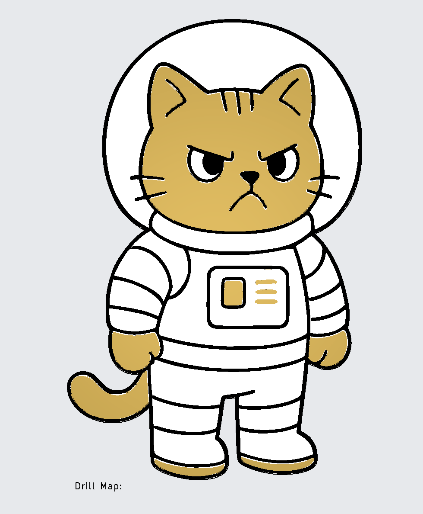

# ACFS3 — Kat in Ruimtepak

Een kat in een ruimtepak, met animerende LEDs aangestuurd door een ATtiny85.

| | |
|---|---|
|  |  |
| *Artwork* | *Lege PCB* |

## Beschrijving

De PCB heeft de vorm van een kat in een ruimtepak. De combinatie van 3mm en 5mm bidirectionele LED's geeft het ontwerp diepte en kleurvariatie.

## Stuklijst

| Aanduiding | Waarde / Type | Aantal |
|------------|--------------|--------|
| U1 | ATtiny85-20P | 1 |
| BT1, BT2 | AA of AAA batterijhouder | 2 |
| C1 | 100nF | 1 |
| D12–D18 | Bidirectionele LED 3mm | 7 |
| D9 | Bidirectionele LED 5mm | 1 |
| R1–R5 | 100Ω–680Ω* | 5 |
| SW1 | DIP-schakelaar 1-polig | 1 |

## Bouwinstructies

Zie de [seriepagina](../README.md) voor de algemene volgorde van montage en de [soldeertips](../../docs/solderen.md).

### Specifieke aandachtspunten

- D9 is een 5mm bidirectionele LED en vormt het accent (helm en borst). Monteer deze als laatste zodat je de hoogte goed kunt bepalen.
- D12–D18 zijn 3mm bidirectionele LED's — soldeer ze op gelijke hoogte voor een uniform uiterlijk.

## Schema

[Interactieve stuklijst (iBOM)](https://htmlpreview.github.io/?https://github.com/renedeboer/elektronica_bouwpakketten/blob/main/angry-cats-from-space/acfs3-ruimtepak/bom/ibom.html)

KiCad projectbestanden: `~/Documents/KiCad/projects/angrycatsfromspace3/`

## Software

Firmware in ontwikkeling — zie [seriepagina](../README.md).

---

## Milieu-informatie

**Belangrijke milieu-informatie betreffende dit product**

Dit symbool op het toestel of de verpakking geeft aan dat dit product aan het einde van zijn levensduur niet bij het gewone huishoudelijk afval mag worden weggegooid. Gooi dit product (inclusief eventuele batterijen) niet bij het huisvuil — breng het naar een erkend inzamelpunt of retourpunt voor recycling. Neem voor meer informatie contact op met uw gemeente of lokale milieuinstantie.

Producten mogen voor recycling altijd worden teruggebracht of opgestuurd via de webshop op [rene-de-boer.nl](https://rene-de-boer.nl).
