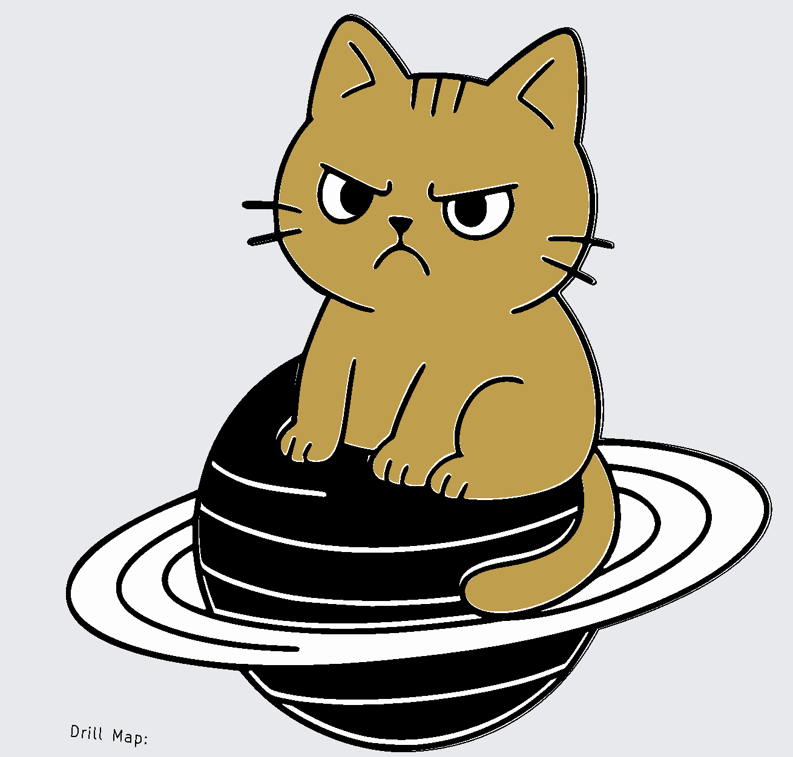

# ACFS5 — Kat bij Saturnus

Een kat naast de planeet Saturnus, met animerende LEDs aangestuurd door een ATtiny85.

## Beschrijving

De PCB toont een kat naast de planeet Saturnus met zijn kenmerkende ringen. De LEDs verlichten zowel de ringen als de kat zelf.

## Stuklijst

| Aanduiding | Waarde / Type | Aantal |
|------------|--------------|--------|
| U1 | ATtiny85-20P | 1 |
| BT1, BT2 | AA of AAA batterijhouder | 2 |
| C1 | 100nF | 1 |
| D1–D8 | LED 3mm | 8 |
| D12–D14 | Bidirectionele LED 3mm | 3 |
| D9 | Bidirectionele LED 5mm | 1 |
| R1–R5 | 100Ω–680Ω* | 5 |
| SW1 | DIP-schakelaar 1-polig | 1 |

## Bouwinstructies

Zie de [seriepagina](../README.md) voor de algemene volgorde van montage en de [soldeertips](../../docs/solderen.md).

## Schema

KiCad projectbestanden: `~/Documents/KiCad/projects/angrycatsfromspace5/`

## Software

Firmware in ontwikkeling — zie [seriepagina](../README.md).

---

## Milieu-informatie

**Belangrijke milieu-informatie betreffende dit product**

Dit symbool op het toestel of de verpakking geeft aan dat, als het na zijn levenscyclus wordt weggeworpen, dit toestel schade kan toebrengen aan het milieu. Gooi dit toestel (en eventuele batterijen) niet bij het gewone huishoudelijke afval; het moet bij een gespecialiseerd bedrijf terechtkomen voor recyclage. U dient dit toestel naar uw verdeler of naar een lokaal recyclagepunt te brengen. Respecteer de plaatselijke milieuwetgeving. Heeft u vragen, contacteer dan de plaatselijke autoriteiten inzake afvalverwijdering.

Producten mogen altijd worden teruggebracht of opgestuurd via de webshop op [rene-de-boer.nl](https://rene-de-boer.nl).
