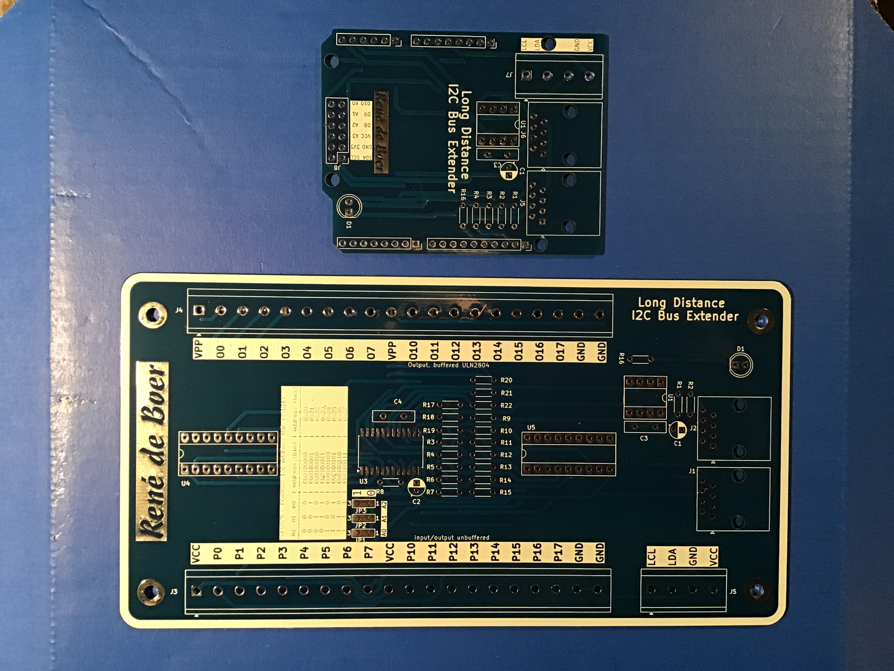
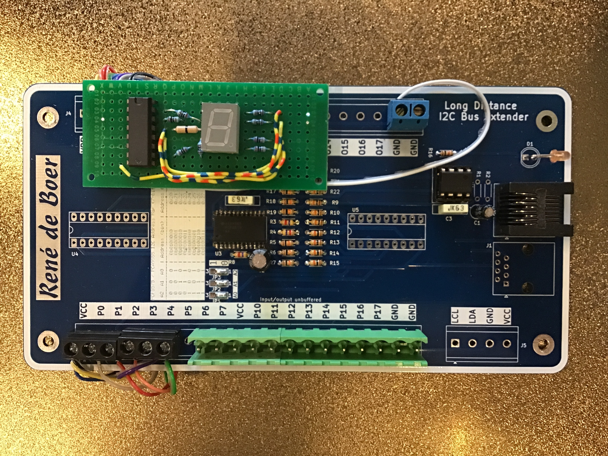

# Long Distance I2C Bus Extender

Een tweedelig systeem voor het aansturen van I2C apparaten over langere kabelafstanden, met een Arduino Uno shield en een uitgebreid remote I/O board.

## Beschrijving

Standaard I2C (400pF buslimiet) werkt goed over korte afstanden op een printplaat. Zodra de kabel langer wordt — naar een apparaat buiten de behuizing — neemt de capaciteit toe en wordt de communicatie onbetrouwbaar.

De **P82B715P** van NXP is een I2C bus buffer die de signaalniveaus omzet zodat langere kabels (tot enkele meters) mogelijk worden, zonder aanpassingen aan de I2C logica of adressen.

Dit bouwpakket bestaat uit **twee PCBs**:

1. **Arduino Uno Shield** (klein) — steekt op de Arduino Uno, bevat de P82B715P en de aansluiting voor de verlengkabel
2. **Remote I/O board** (groot) — aan het einde van de kabel; heeft 18 I/O pinnen (P0–P17) met gebufferde uitgangen via een ULN2804, ongebufferde I/O, en aansluitklemmen voor externe apparatuur

*Het complete systeem: Arduino Uno met shield (boven links), remote board (onder) en verbindingskabel*

## Praktische toepassing

Een eerste uitgewerkte toepassing van dit bouwpakket is te vinden in het **[Jingle Player project](https://github.com/renedeboer/jingle_player)**, waarbij het remote board op afstand wordt aangestuurd vanuit een Arduino.

Het bouwpakket leent zich voor alle situaties waarbij I2C-apparaten op enige afstand van de controller moeten werken, of waarbij je veel geïsoleerde I/O-pinnen nodig hebt op een remote locatie.

*Voorbeeld maatwerkproject: remote board met een 7-segment display als uitbreiding*

## Schema

**Arduino Uno Shield:**

**Remote I/O board (P82B715P):**

[Interactieve stuklijst (iBOM)](https://htmlpreview.github.io/?https://github.com/renedeboer/elektronica_bouwpakketten/blob/main/arduino-i2c-shield/bom/ibom.html)

## Stuklijst

### Arduino Uno Shield

<!-- stuklijst volgt na verificatie van het schema -->

### Remote I/O board (P82B715P)

<!-- stuklijst volgt na verificatie van het schema -->

## Aansluitingen remote board

| Connector | Functie |
|-----------|---------|
| P0–P7 | I/O pinnen, ongebufferd |
| P8–P17 | Uitgangen, gebufferd via ULN2804 |
| VPP / VCC / GND | Voeding |
| J1 | I2C aansluiting (van shield via kabel) |
| J2 | I2C doorlus naar volgend apparaat |
| J3 | Aansluitklemmen voor externe bedrading |
| J5 | LCL / LDA / GND / VCC |

## Bouwinstructies

Zie [soldeertips en techniek](../docs/solderen.md) voor algemene soldeerinformatie.

### Specifieke aandachtspunten

- De shield past standaard op een Arduino Uno R3. Gebruik "stackable headers" zodat de Uno nog via USB bereikbaar blijft.
- De P82B715P werkt bidirectioneel — de "near" en "far" kant kunnen worden omgekeerd.
- De ULN2804 op het remote board heeft open-collector uitgangen — sluit een pull-up weerstand aan op de externe voeding voor elke uitgang die je gebruikt.

## KiCad bestanden

Beide schema's en PCB bestanden staan in: `~/Documents/KiCad/projects/P82B715P/`
