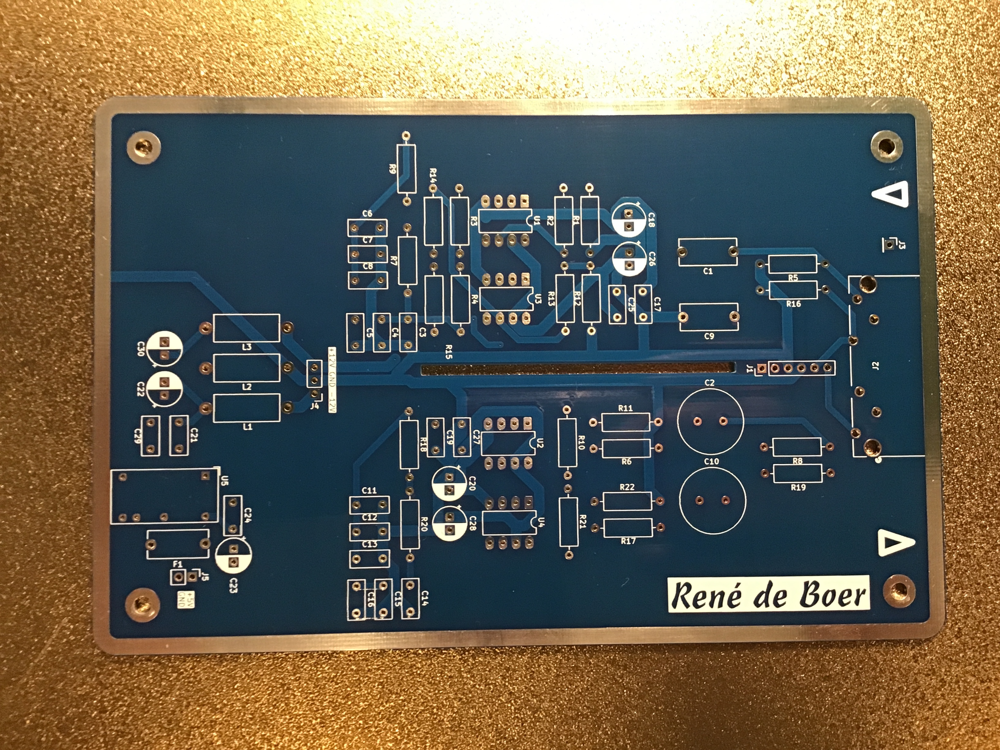
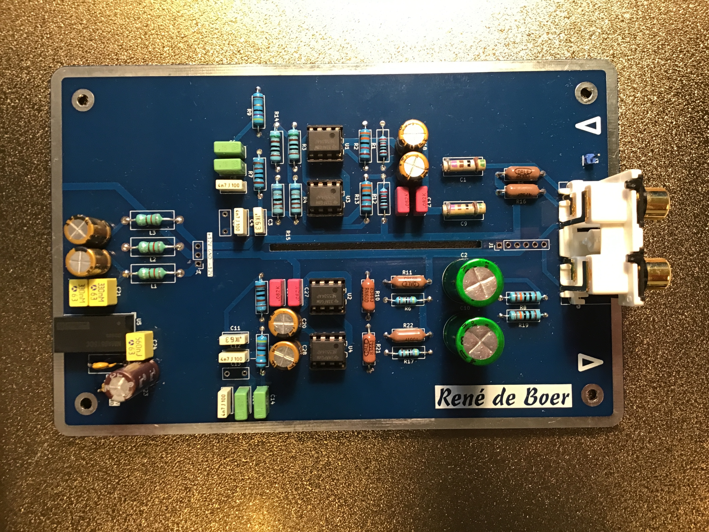

# Phono Voorversterker met Passief RIAA Netwerk

Een stereo phono voorversterker voor MM (Moving Magnet) platenspelers, met een **passief RIAA netwerk tussen twee op-amp trappen**.

| | |
|---|---|
|  |  |
| *Lege PCB* | *Bestukt prototype — stereo, twee kanalen* |

## Beschrijving

Een platenspeler met een MM element heeft twee dingen nodig om correct te klinken:

1. **Versterking** — het signaal van een platenspelerelement is erg zwak (enkele millivolts)
2. **RIAA equalisatie** — bij het persen van een plaat worden hoge frequenties versterkt en lage gedempt opgeslagen. Bij het afspelen moet dit precies omgekeerd worden.

### Topologie: passief RIAA netwerk tussen twee versterkingstrappen

In de meest gebruikte ontwerpen zit het RIAA filter in de terugkoppellus van de op-amp. De gain van de op-amp varieert dan met de frequentie, wat kan leiden tot Transient Intermodulation Distortion (TIM) en wisselende terugkoppeling bij lage en hoge frequenties.

In dit ontwerp werken **twee op-amp trappen elk met constante gain**, en zit het RIAA netwerk er **passief tussen** als een verzwakkingsfilter. De voordelen:

- Geen TIM — de op-amp werkt altijd in dezelfde werkcondities
- Geen frequentie-afhankelijke terugkoppeling
- Het geluid wordt door luisteraars als "sneller" en neutraler beschreven

Het nadeel is dat een passief filter in het middengebied ~90% van het signaal weggooit, en in de hoogte ~99% — vandaar dat er twee versterkingstrappen nodig zijn. Met een ruis-arme op-amp als de OPA606 is dit geen probleem.

De schakeling is ontworpen door **Walter G. Jung** en gepubliceerd in de OPA606 datasheet. Exacte componentwaarden geven een RIAA nauwkeurigheid van ±0,01 dB bij gebruik van 1% weerstanden.

Het bouwpakket is **stereo** (twee identieke kanalen op één PCB).

### Alternatieve op-amps

Het originele ontwerp gebruikt de **OPA606** (FET-ingang, Burr-Brown). Directe alternatieven:

| Op-amp | Opmerking |
|--------|-----------|
| **OPA606** | Origineel — FET-ingang, laag ruisgetal, Burr-Brown/TI |
| **OP27** | Bipolaire ingang, uitstekend ruisgedrag, klassiek audiotype |
| **OP37** | Zelfde als OP27 maar voor hogere gesloten-lus versterking (>5×) |
| **NE5534** | Goedkoop, breed verkrijgbaar en uitstekend voor audio |
| **Discrete op-amp** | Mogelijk, maar de interne DC/DC converter levert mogelijk niet voldoende stroom voor discrete topologieën |

## Schema

[Interactieve stuklijst (iBOM)](https://htmlpreview.github.io/?https://github.com/renedeboer/elektronica_bouwpakketten/blob/main/passieve-phono/bom/ibom.html)

## Stuklijst

<!-- stuklijst volgt na verificatie van het schema -->

## Aansluitingen

| Connector | Functie |
|-----------|---------|
| Ingang L/R | Van de platenspeler (RCA) |
| Uitgang L/R | Naar de versterker lijningang (RCA) |
| Voeding | Symmetrische voeding voor de op-amps |
| Massa/aarde | Aardedraad platenspeler aansluiten |

## Bouwinstructies

Zie [soldeertips en techniek](../docs/solderen.md) voor algemene soldeerinformatie.

### Specifieke aandachtspunten

- Zorg voor goede afscherming van de aansluitkabels — een platenspelersignaal is erg zwak en gevoelig voor brom en storing.
- De aardedraad van de platenspeler (apart van de signaalkabel) aansluiten op de massapin.
- Beide kanalen zijn identiek — controleer bij problemen of de componentwaarden per kanaal overeenkomen.

## Bronvermelding

De schakeling is afkomstig uit de **OPA606 datasheet (Burr-Brown / Texas Instruments)**, waar hij wordt toegeschreven aan **Walter G. Jung**.

## KiCad bestanden

Projectbestanden: `~/Documents/KiCad/projects/passivephono/`

---

## Milieu-informatie

**Belangrijke milieu-informatie betreffende dit product**

Dit symbool op het toestel of de verpakking geeft aan dat, als het na zijn levenscyclus wordt weggeworpen, dit toestel schade kan toebrengen aan het milieu. Gooi dit toestel (en eventuele batterijen) niet bij het gewone huishoudelijke afval; het moet bij een gespecialiseerd bedrijf terechtkomen voor recyclage. U dient dit toestel naar uw verdeler of naar een lokaal recyclagepunt te brengen. Respecteer de plaatselijke milieuwetgeving. Heeft u vragen, contacteer dan de plaatselijke autoriteiten inzake afvalverwijdering.

Producten mogen altijd worden teruggebracht of opgestuurd via de webshop op [rene-de-boer.nl](https://rene-de-boer.nl).
