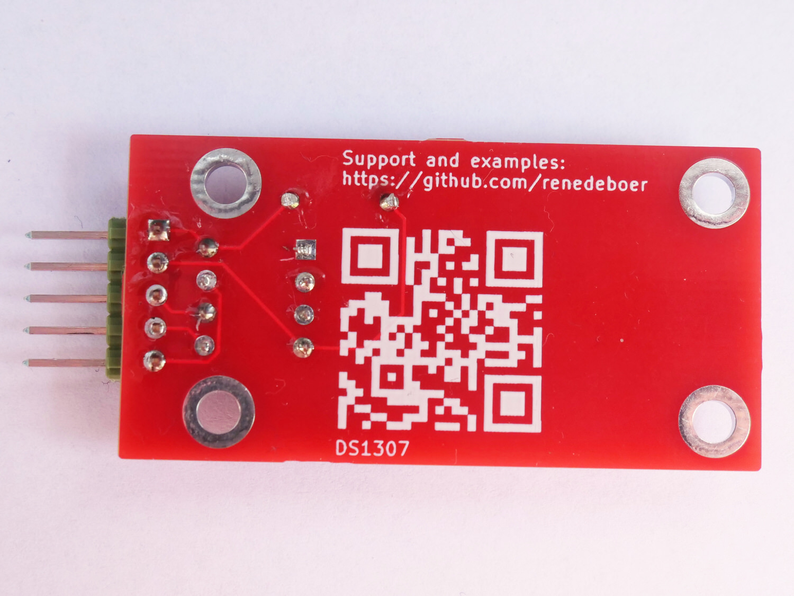
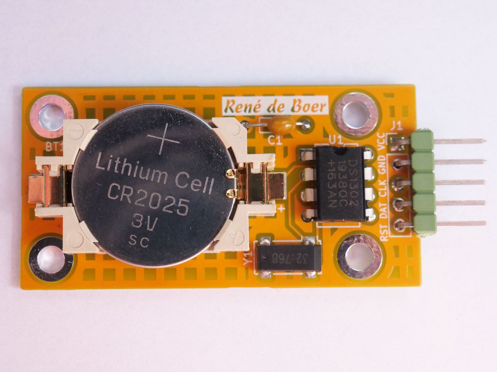
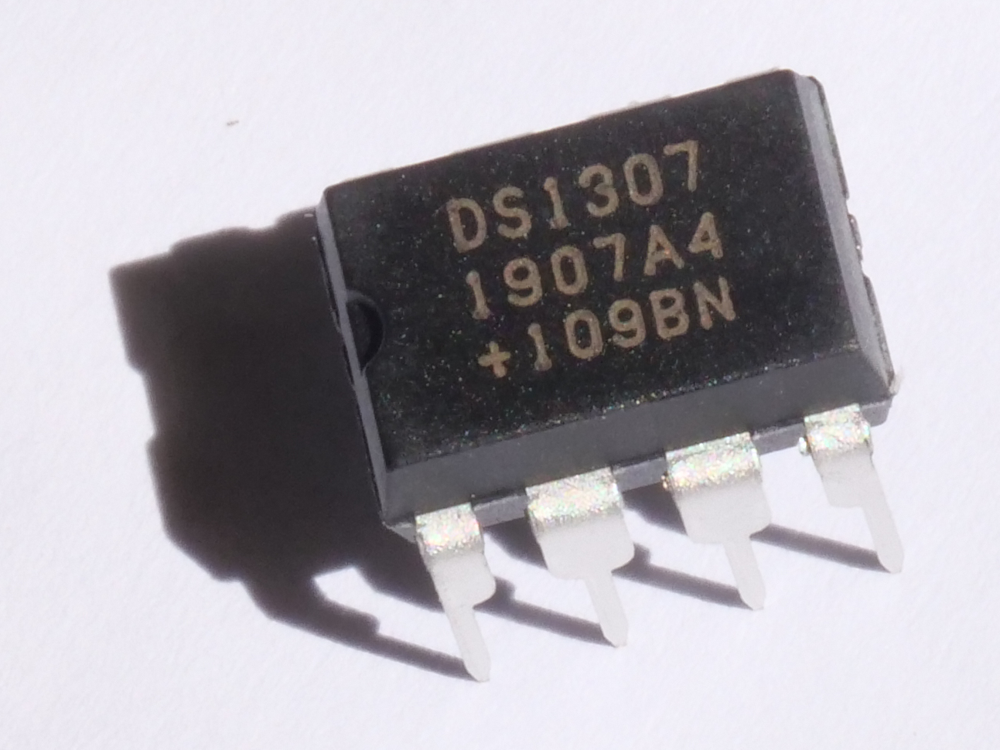

# RTC Module

Een compacte real-time clock module op basis van de DS1307, met I2C interface en bijbehorende Arduino library.

## Varianten

| | | | |
|---|---|---|---|
|  |  |  |  |
| *DS1307 — voorkant* | *DS1307 — achterkant* | *DS1302 — voorkant* | *DS1307 IC* |

## Beschrijving

De RTC module houdt de tijd bij (uren, minuten, seconden, datum) onafhankelijk van de hoofdschakeling, gevoed door een CR2032 knoopcelbatterij. Communicatie verloopt via I2C, waardoor de module werkt met vrijwel elke microcontroller of computer met een I2C bus — waaronder Arduino, maar ook de [ZX Spectrum 48K](../zx-spectrum-i2c/) via de I2C uitbreidingskaart.

De module wordt gebruikt in de [VFD Klok](../vfd-klok/).

## Repository

De broncode en Arduino library staan in de eigen GitHub repository:

**[github.com/renedeboer/ReneDeBoer_RTC](https://github.com/renedeboer/ReneDeBoer_RTC)**

## Bestellen

Module beschikbaar via **[rene-de-boer.nl](https://rene-de-boer.nl)**.

---

## Milieu-informatie

**Belangrijke milieu-informatie betreffende dit product**

Dit symbool op het toestel of de verpakking geeft aan dat, als het na zijn levenscyclus wordt weggeworpen, dit toestel schade kan toebrengen aan het milieu. Gooi dit toestel (en eventuele batterijen) niet bij het gewone huishoudelijke afval; het moet bij een gespecialiseerd bedrijf terechtkomen voor recyclage. U dient dit toestel naar uw verdeler of naar een lokaal recyclagepunt te brengen. Respecteer de plaatselijke milieuwetgeving. Heeft u vragen, contacteer dan de plaatselijke autoriteiten inzake afvalverwijdering.

Producten mogen altijd worden teruggebracht of opgestuurd via de webshop op [rene-de-boer.nl](https://rene-de-boer.nl).
