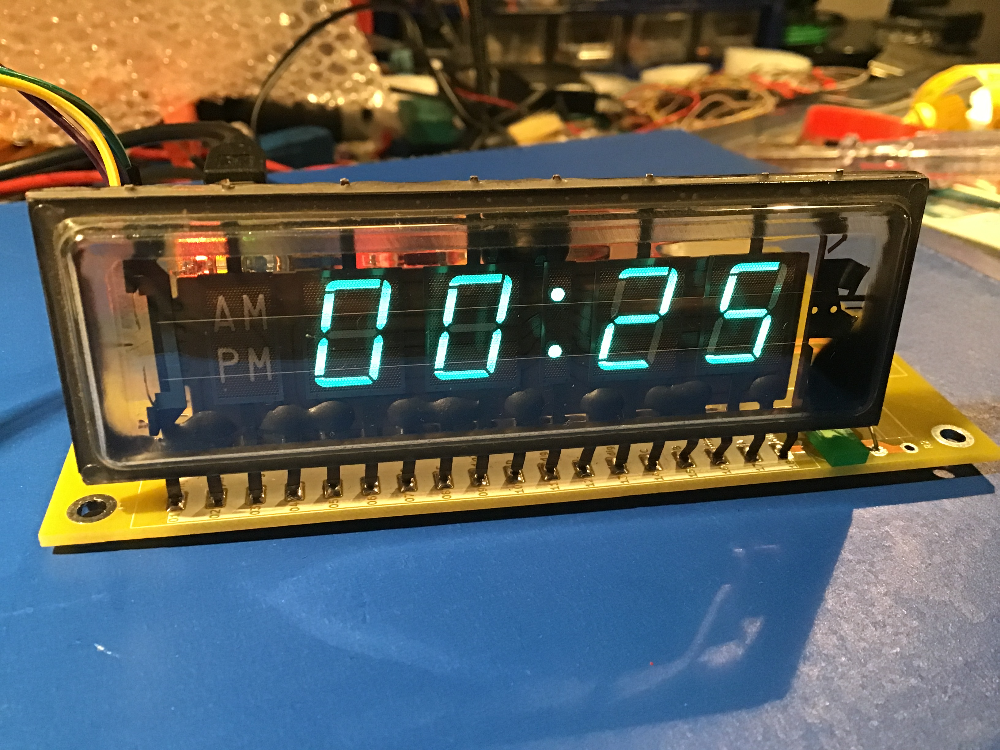
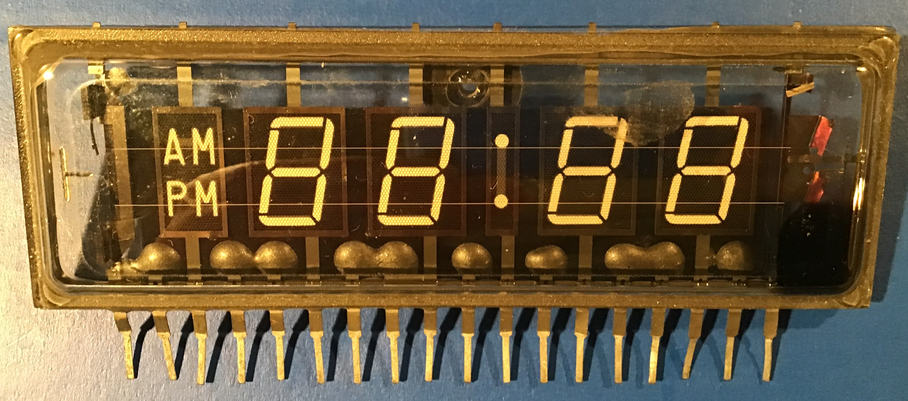
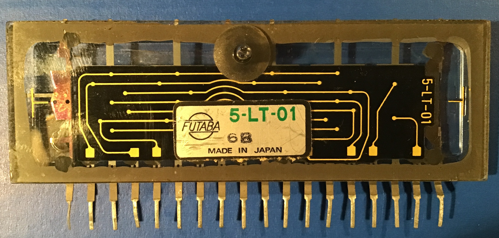
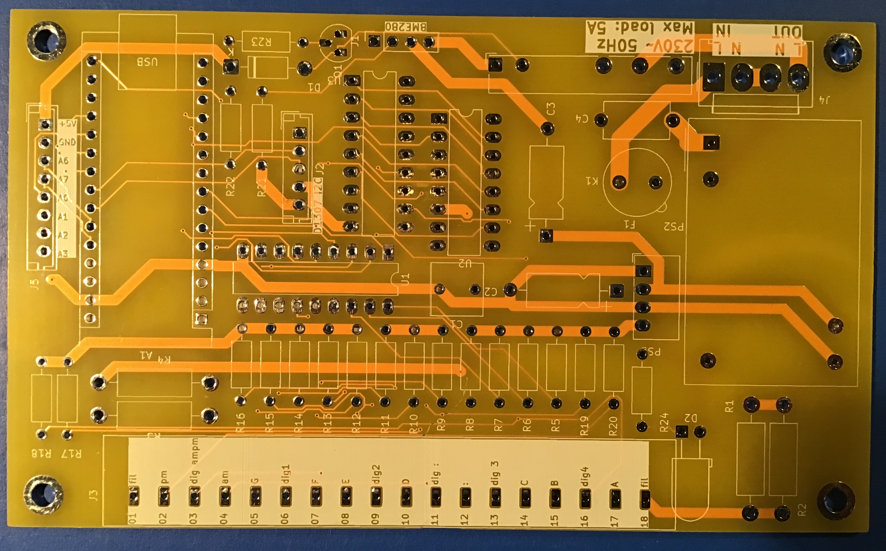
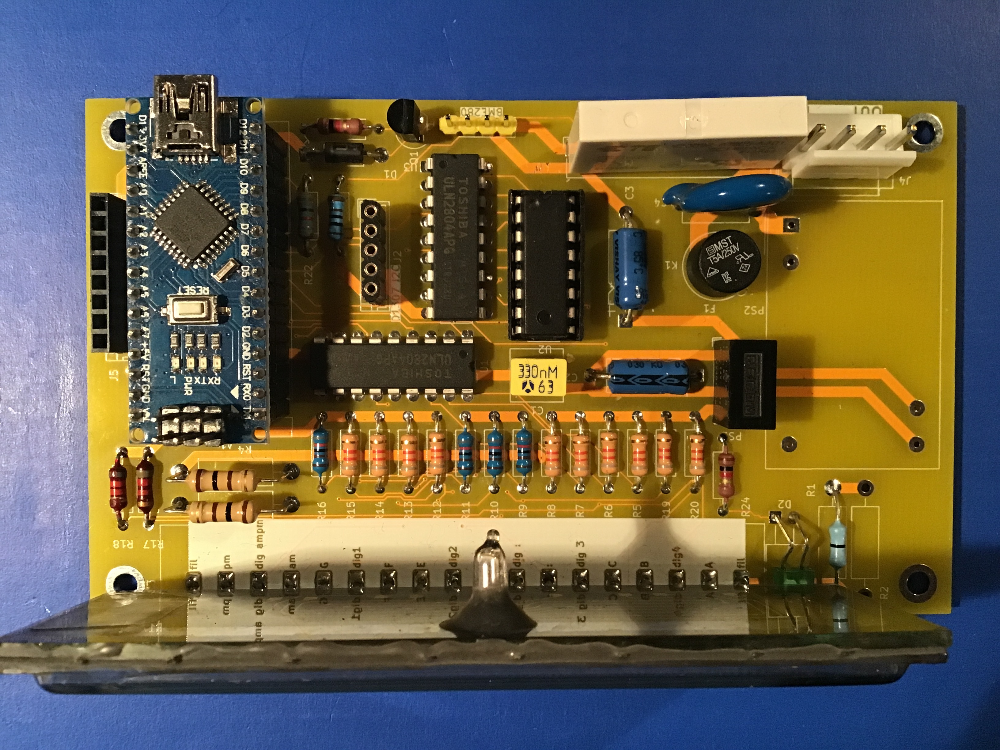
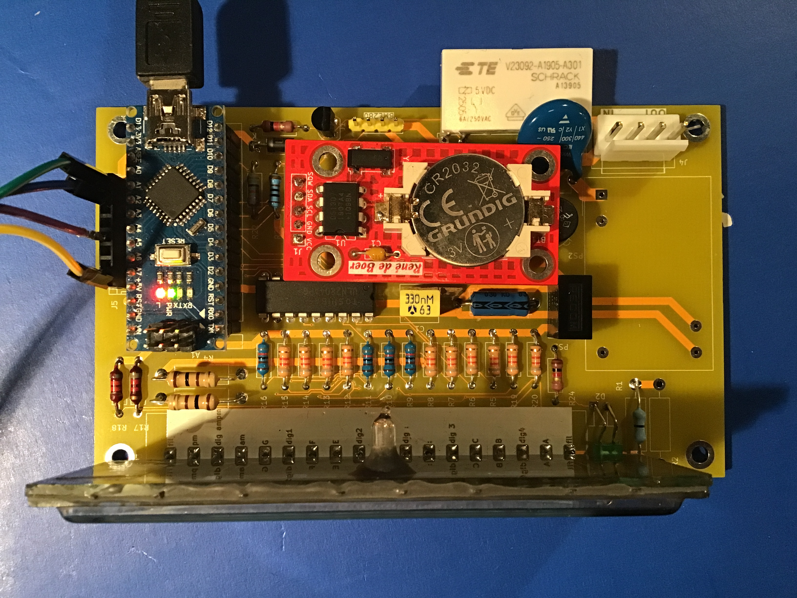

# VFD Klok

Een klok met een vacuüm fluorescentie display (VFD), aangestuurd door een Arduino Nano met RTC module en temperatuur-/drukmeting.

## Beschrijving

Een VFD (Vacuum Fluorescent Display) is een oudere maar prachtige displaytechnologie — helder blauw-groen, met een retro uitstraling. Dit bouwpakket bouwt een volledige klok rondom zo'n display.

Het bouwpakket is ontworpen voor de **Futaba 5-LT-01**, een vintage Japans VFD met 4 cijfers en een dubbele punt, in een hermetisch gesloten glazen behuizing. Dit type display is tweedehands verkrijgbaar.

| | |
|---|---|
|  |  |
| *Futaba 5-LT-01 — voorkant (alle segmenten)* | *Achterkant met aansluitpinnen* |

### Functies

- Tijdsweergave (uren, minuten) via DS1307 RTC module
- Temperatuur- en luchtdrukweergave via BMP280 sensor
- Relais voor het schakelen van een extern apparaat (bijv. lamp aan/uit op tijdstip)
- Dimbare display (PWM via Arduino)
- Microfooningang voor geluidsgevoeligheid (optioneel)
- Voeding rechtstreeks op 230V wisselspanning

### Hoe het werkt

Het VFD display heeft 5 posities (4 cijfers + dubbele punt). Elke positie wordt aangestuurd via een **74HCT138** decoder en twee **ULN2804A** darlington arrays. De Arduino Nano multiplext de posities snel achter elkaar — zo snel dat het oog het niet ziet.

De **RTC module** (gebaseerd op de DS1307) houdt de tijd bij, ook als de stroom uitvalt (met een CR2032 backup batterij op de module). De RTC module is een eigen ontwerp en ook te bestellen via de [webshop](https://rene-de-boer.nl) — zie ook de [GitHub pagina van de RTC module](https://github.com/renedeboer/ReneDeBoer_RTC). De **BMP280** meet temperatuur en luchtdruk via I2C.

De 230V wisselspanning wordt omgezet naar 5V door een **IRM-03-5** AC/DC module, en naar 15V voor het VFD door een **MEE1S0515SC** DC/DC converter.

## Schema

[Interactieve stuklijst (iBOM)](https://htmlpreview.github.io/?https://github.com/renedeboer/elektronica_bouwpakketten/blob/main/vfd-klok/bom/ibom.html)

## Stuklijst

| Aanduiding | Waarde / Type | Aantal |
|------------|--------------|--------|
| A1 | Arduino Nano v3 | 1 |
| U1, U3 | ULN2804A darlington array (DIP-18) | 2 |
| U2 | 74HCT138 3-naar-8 decoder (DIP-16) | 1 |
| PS1 | MEE1S0515SC DC/DC converter | 1 |
| PS2 | IRM-03-5 AC/DC converter | 1 |
| K1 | Fujitsu FTR-LYCA005x relais | 1 |
| Q1 | NPN transistor (TO-92) | 1 |
| D1 | Diode (DO-41) | 1 |
| D2 | LED 5mm horizontaal | 1 |
| F1 | Zekering + houder (TR5 Littelfuse) | 1 |
| J1 | 4-pins header voor BMP280 module | 1 |
| J2 | 5-pins JST-EH voor RTC module (DS1307) | 1 |
| J3 | 18-pins VFD display connector | 1 |
| J4 | 4-pins Molex KK-396 (230V / relaisuitgang) | 1 |
| J5 | 8-pins JST-EH analoog ingang | 1 |
| C1 | Condensator (C_Rect P5mm) | 1 |
| C2, C3 | Elektrolytische condensator axiaal | 2 |
| C4 | Schijfcondensator 9mm | 1 |
| R1–R4 | 50Ω | 4 |
| R5–R20 | 10kΩ | 16 |
| R21–R24 | 1kΩ | 4 |

## Software

De Arduino broncode staat in de [software map](software/):

- `vfd_display.ino` — hoofdprogramma

### Bibliotheken

- `Wire.h` — I2C communicatie (standaard)
- `RTClib.h` — Adafruit RTC library voor DS1307

### Uploaden

1. Installeer de Arduino IDE
2. Installeer de `RTClib` library via de Library Manager
3. Sluit de Arduino Nano aan via USB
4. Selecteer: Board = `Arduino Nano`, Processor = `ATmega328P`
5. Upload `vfd_display.ino`

## Bouwinstructies

Zie [soldeertips en techniek](../docs/solderen.md) voor algemene soldeerinformatie.

### WAARSCHUWING — 230V wisselspanning

Dit bouwpakket werkt op **230V wisselspanning**. Neem de volgende voorzorgsmaatregelen:

- **Werk nooit aan de 230V bedrading als de stekker in het stopcontact zit**
- Zorg dat alle 230V aansluitingen goed geïsoleerd zijn in een passende behuizing
- De zekering F1 beschermt het circuit — vervang uitsluitend met de opgegeven waarde
- Laat kinderen nooit onbegeleid met dit bouwpakket werken

### De PCB

*Lege PCB — onderkant met koperbanen*

### Volgorde van montage

1. Weerstanden R1–R24
2. Condensatoren C1–C4 (let op polariteit C2, C3)
3. Diode D1 (let op richting)
4. Transistor Q1 (let op vlakke kant)
5. IC-sockets voor U1, U2, U3
6. LED D2
7. Zekeringhouder F1
8. Relais K1
9. DC/DC converter PS1
10. AC/DC converter PS2
11. Connectors J1–J5
12. VFD display connector J3
13. IC's in de sockets plaatsen
14. Arduino Nano op headers
15. Modules (RTC, BMP280) aansluiten

*PCB volledig bestukt, voor plaatsing van de RTC module*

*PCB volledig gemonteerd inclusief RTC module (rood) en Arduino Nano*

## KiCad bestanden

Projectbestanden: `~/Documents/KiCad/projects/vfd/`
