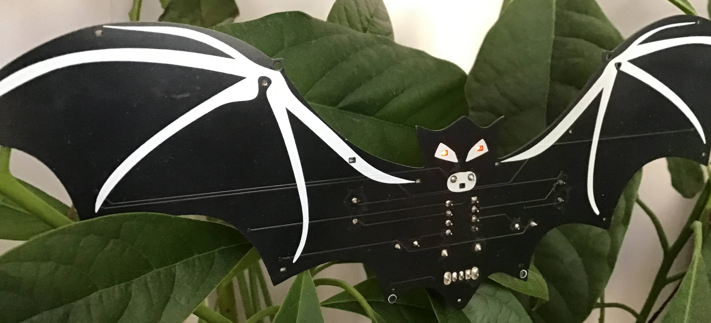

# Vleermuis

Een decoratief LED-bouwpakket in de vorm van een vleermuis, aangestuurd door een ATtiny85 via charlieplexing.

## Beschrijving

De PCB heeft de vorm van een vleermuis met 20 LEDs aangestuurd via charlieplexing op 5 pinnen van de ATtiny85. De firmware gebruikt een mood-systeem: het apparaatje wisselt willekeurig tussen rustig, speels en eng gedrag, met bijpassende LED-animaties (ogen, vleugels, mond).

De vleermuis vormt de inspiratie voor de [Angry Cats From Space](../angry-cats-from-space/) serie.

## Repository

De broncode, schema's en bouwinstructies staan in de eigen GitHub repository:

**[github.com/renedeboer/ReneDeBoer_Vleermuis](https://github.com/renedeboer/ReneDeBoer_Vleermuis)**

## Bestellen

Printplaat en bouwpakket beschikbaar via **[rene-de-boer.nl](https://rene-de-boer.nl)**.

---

## Milieu-informatie

**Belangrijke milieu-informatie betreffende dit product**

Dit symbool op het toestel of de verpakking geeft aan dat dit product aan het einde van zijn levensduur niet bij het gewone huishoudelijk afval mag worden weggegooid. Gooi dit product (inclusief eventuele batterijen) niet bij het huisvuil — breng het naar een erkend inzamelpunt of retourpunt voor recycling. Neem voor meer informatie contact op met uw gemeente of lokale milieuinstantie.

Producten mogen voor recycling altijd worden teruggebracht of opgestuurd via de webshop op [rene-de-boer.nl](https://rene-de-boer.nl).
