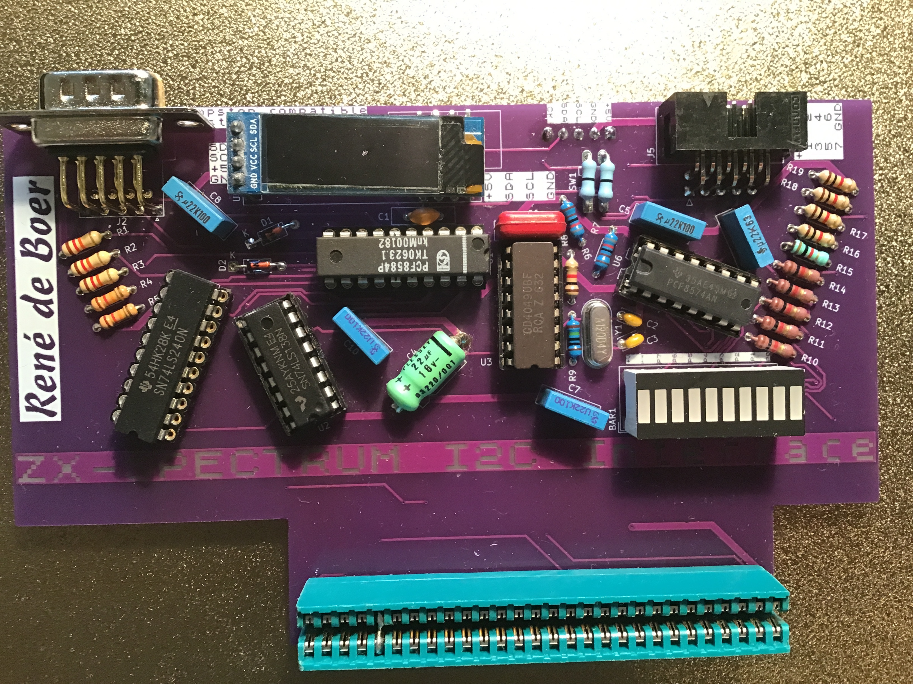
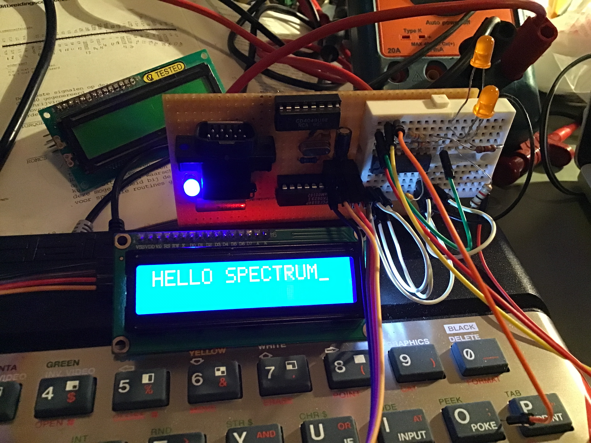
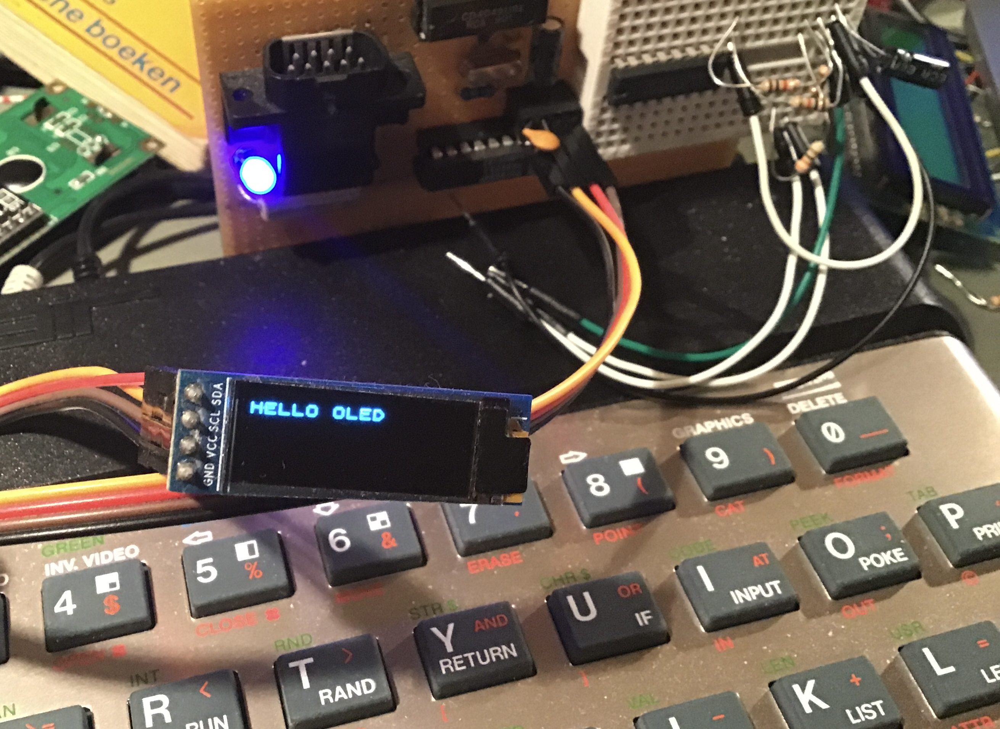
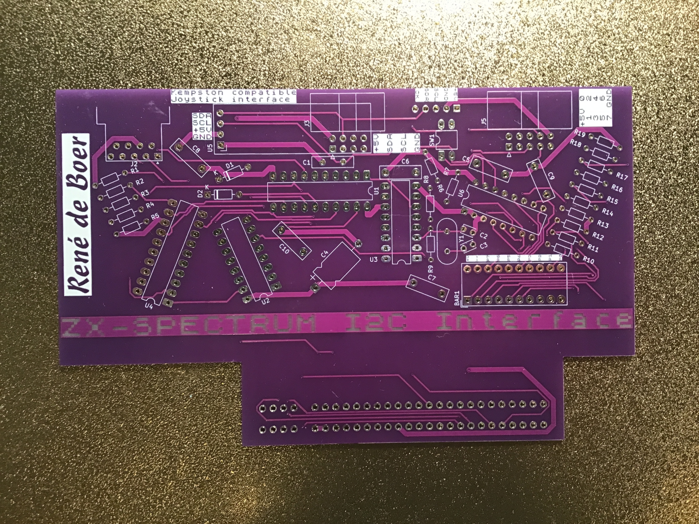
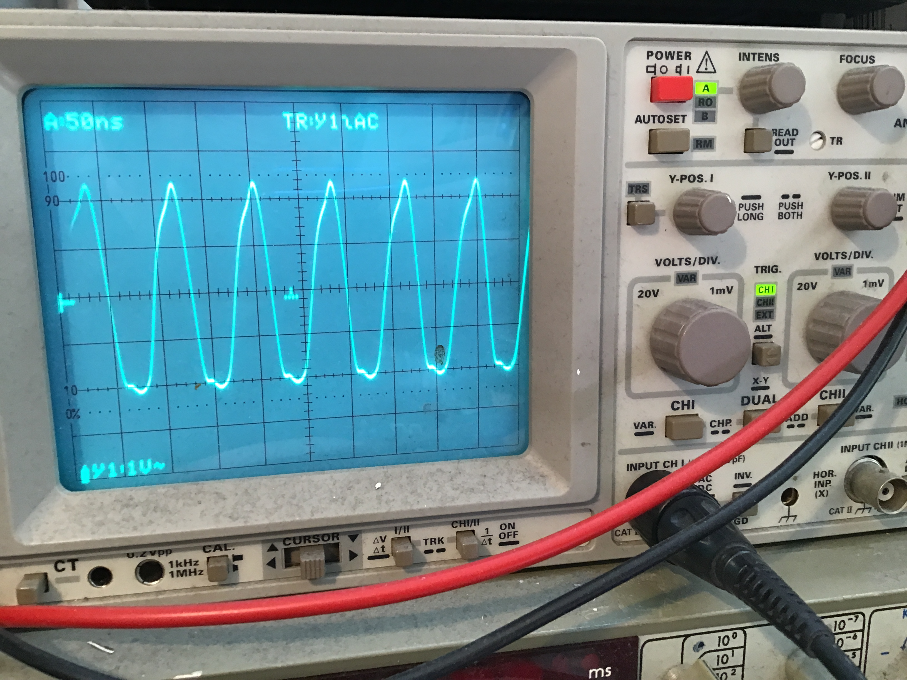
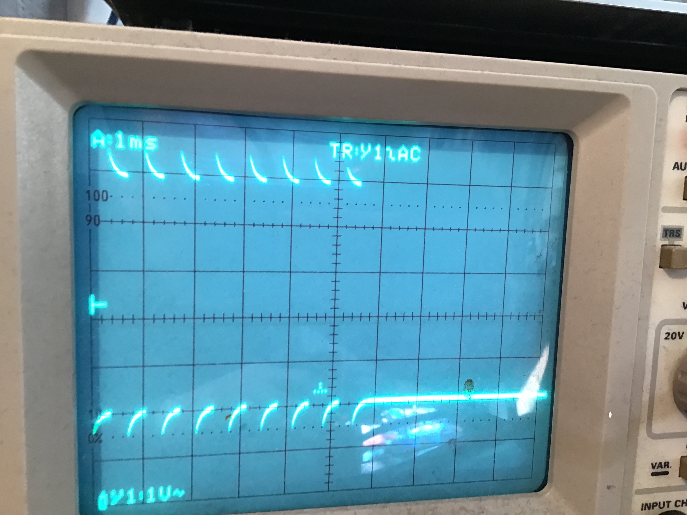
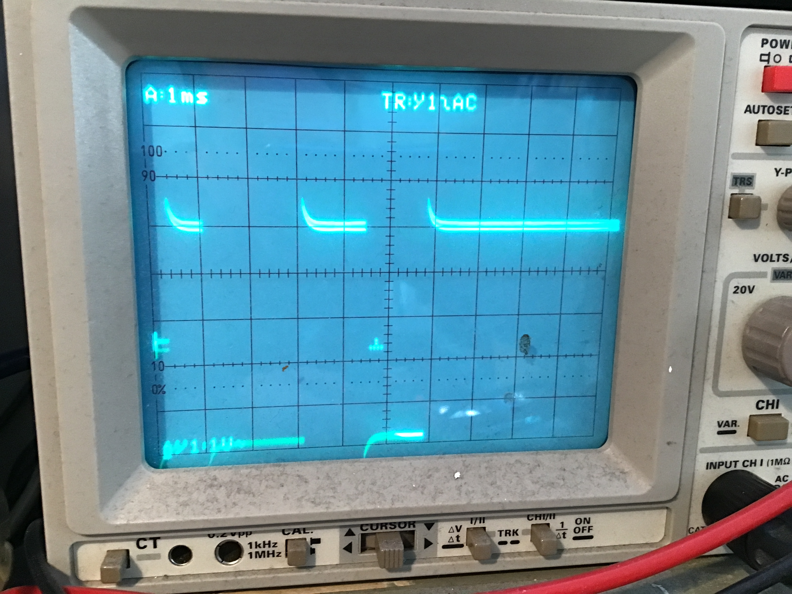
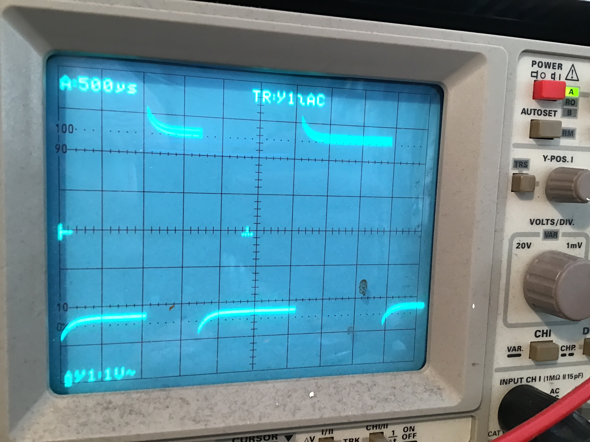

# ZX Spectrum I2C Interface

Een uitbreidingskaart voor de **ZX Spectrum 48K** die I2C communicatie mogelijk maakt via de edge connector. Inclusief Kempston-compatibele joystick interface en ZX BASIC softwarebibliotheek.



## Beschrijving

De ZX Spectrum heeft van huis uit geen I2C bus. Deze uitbreidingskaart voegt I2C toe via de **PCF8584** I2C bus controller, die op het ZX Spectrum busadres wordt aangesloten. Zo zijn alle moderne I2C sensoren, displays en modules te gebruiken vanuit ZX BASIC — op een computer uit 1982.

### Functies

- I2C bus via **PCF8584** controller (eigen klokgenerator, onafhankelijk van de Z80)
- 8-bit I/O expander via **PCF8574P**
- Aansluiting voor **0,91" OLED display** (I2C, rechtstreeks op de kaart)
- **HDSP-4850** 10-segment bargraph LED met drie functies:
  - 8 segmenten tonen de toestand van de PCF8574 uitgangen (laag = LED aan)
  - 1 segment als voedings-indicator (power LED)
  - 1 segment verbonden met de RTC CLK uitgang — knippert op 1Hz als de [RTC module](https://github.com/renedeboer/ReneDeBoer_RTC) aangesloten is (de RTC module werkt met elke I2C master, ook de ZX Spectrum)
- **Kempston-compatibele joystick interface** (DB9) — gecombineerd op deze kaart zodat I2C en joystick gelijktijdig werken
- Adresbepaling via **74LS138** decoder
- Busbuffering via **74LS240**
- Klokgenerator voor PCF8584 via **4049** hex inverter + kristal (onafhankelijk van de Z80 klok)
- DIP-schakelaar voor in-/uitschakelen van de I2C **pullup weerstanden**
- Sluit aan op de **ZX Spectrum 48K edge connector**

### Hoe het werkt

De PCF8584 verschijnt als een geheugenadres op de ZX Spectrum bus. Via `IN`/`OUT` instructies in machinecode — aangeroepen vanuit BASIC — stuurt de Z80 I2C berichten aan. De PCF8584 regelt zelf de I2C timing en protocollen.

## In werking

De werkingsfoto's zijn gemaakt met het prototype op gaatjesprint — de PCB werkt identiek.

| | |
|---|---|
|  |  |
| *LCD versie: 16×2 LCD via I2C backpack (PCF8574T → HD44780)* | *OLED versie: 0,91" OLED direct via I2C* |

## De PCB

| | |
|---|---|
|  |  |
| *Lege PCB — bovenkant* | *Volledig bestukt met OLED display gemonteerd* |

## Schema


[Interactieve stuklijst (iBOM)](https://htmlpreview.github.io/?https://github.com/renedeboer/elektronica_bouwpakketten/blob/main/zx-spectrum-i2c/bom/ibom.html)

## Stuklijst

| Aanduiding | Waarde / Type | Aantal |
|------------|--------------|--------|
| U1 | PCF8584 I2C bus controller (DIP) | 1 |
| U2 | PCF8574P I2C I/O expander (DIP) | 1 |
| U3 | 74LS138 3-naar-8 decoder (DIP) | 1 |
| U4 | 74LS240 octal buffer (DIP) | 1 |
| U5 | 4049 hex inverter — klokgenerator voor PCF8584 (DIP) | 1 |
| Y1 | Kristal (voor PCF8584 klok) | 1 |
| J1 | ZX Spectrum 48K edge connector | 1 |
| J2 | OLED display connector (I2C) | 1 |
| BAR1 | HDSP-4850 10-segment bargraph LED (groen) | 1 |
| J4 | DB9 joystick connector (Kempston) | 1 |
| J5 | Uitbreidingsconnector | 1 |
| SW1 | DIP-schakelaar 2-polig (pullup weerstanden I2C bus) | 1 |
| D1, D2 | 1N914 signaaldiode | 2 |
| C1–C9 | Diverse condensatoren (100nF, 22pF, 15µF, 1nF) | 9 |
| R1–R19 | Diverse weerstanden (10kΩ, 900Ω, 1MΩ) | 19 |

## Software

De ZX BASIC software staat in de [software map](software/). Bronbestanden (`.txt`) worden gecompileerd naar tapefile (`.tap`) met [zmakebas](https://github.com/z00m128/zmakebas).

### Bestanden

| Bestand | Inhoud |
|---------|--------|
| `i2clib.txt` / `.tap` | I2C basisbibliotheek — PCF8584 initialisatie en byte-verzending |
| `i2clcd.txt` / `.tap` | LCD aansturing via PCF8574T → HD44780 (I2C backpack) |
| `i2cOled.txt` / `.tap` | OLED display aansturing (0,91") |
| `i2cscan.txt` / `.tap` | I2C bus scanner — zoekt alle aangesloten apparaten |
| `i2cdiag.txt` / `.tap` | Diagnose en testprogramma |
| `lcdtest.txt` / `.tap` | LCD testprogramma |
| `i2clcd_hello_world.txt` | Minimaal LCD Hello World voorbeeld |
| `i2clib_with_labels.txt` | Bibliotheek met benoemde BASIC-labels |

### Compileren en laden

```bash
cd software
zmakebas -l -a @start -o i2clib.tap i2clib.txt
```

De `.tap` bestanden worden geladen op een echte ZX Spectrum of emulator:

```
LOAD ""
```

### Architectuur van i2clib

- **BASIC deel** — initialisatie, LCD-commando's, cursor, stringweergave
- **Machinecode deel** (48 bytes op adres 64900) — polls PCF8584 PIN-bit na elk byte
- **Sendbuffer** (op adres 64948) — `[aantal_bytes] [byte0..byteN]`

## Oscilloscoopmetingen

Gemeten tijdens ontwikkeling om correcte I2C signaalvormen te verifiëren.

| | |
|---|---|
|  |  |
| *PCF8584 klokgenerator (~50ns/div)* | *I2C startconditie en SCL pulsen (1ms/div)* |
|  |  |
| *I2C datatransfer met ACK (1ms/div)* | *SDA en SCL detail (500µs/div)* |

## Bouwinstructies

Zie [soldeertips en techniek](../docs/solderen.md) voor algemene soldeerinformatie.

### Specifieke aandachtspunten

- De **edge connector** heeft een rasterafstand van 3,96mm — gebruik de juiste connector.
- De **PCF8584** klokgenerator bestaat uit de **4049** hex inverter met kristal en 22pF condensatoren — onafhankelijk van de Z80 systeemklok.
- Gebruik uitsluitend **LS-serie of HCT-serie** logica voor compatibiliteit met de 5V ZX Spectrum bus.
- Controleer het I2C adres van je display en stel de DIP-schakelaar dienovereenkomstig in.

## KiCad bestanden

Projectbestanden: `~/Documents/KiCad/projects/zxi2c/`

---

## Milieu-informatie

**Belangrijke milieu-informatie betreffende dit product**

Dit symbool op het toestel of de verpakking geeft aan dat, als het na zijn levenscyclus wordt weggeworpen, dit toestel schade kan toebrengen aan het milieu. Gooi dit toestel (en eventuele batterijen) niet bij het gewone huishoudelijke afval; het moet bij een gespecialiseerd bedrijf terechtkomen voor recyclage. U dient dit toestel naar uw verdeler of naar een lokaal recyclagepunt te brengen. Respecteer de plaatselijke milieuwetgeving. Heeft u vragen, contacteer dan de plaatselijke autoriteiten inzake afvalverwijdering.

Producten mogen altijd worden teruggebracht of opgestuurd via de webshop op [rene-de-boer.nl](https://rene-de-boer.nl).
